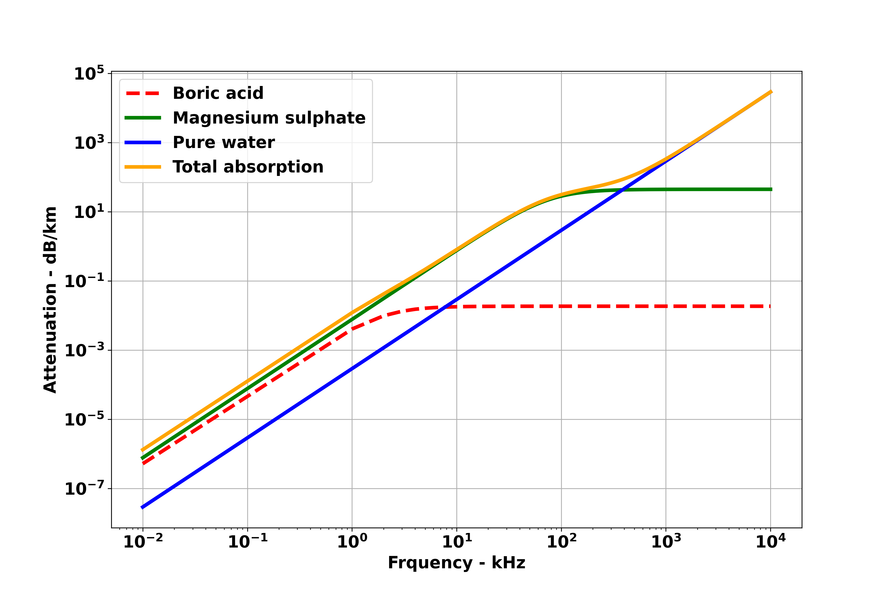

# Absorption-of-sound-waves-in-Water
Absorption of sound waves in Water

```python
##################################################################################
# Author : Jay Patel, Dalhousie University
# Absorption of sound waves in Water
##################################################################################

import numpy as np
import matplotlib.pyplot as plt

f= np.arange(1e-2,10e3) # in kHz
S= 35 # salinity
T= 10 # temmperature in degree centi grad
pH= 7.8  # Water pH level
theta= 273+T   # Angle 
D= 500 # Depth in meter
c= 1412+3.21*T+1.19*S+0.0167*D  # Sound speed in Water  1500 m/s
 
# Boric Acid Contribution 
A1= 8.86/c*10**(0.78*pH-5) # Absorption in Boric acid
p1= 1  # pressur in Boric acid
f1= 0.78* np.sqrt(S/35)*10**(T/26) # frequency in Boric acid

# MgSO_4 Contribution 
A2= 21.44* S/c*(1+0.025*T)   # Absorption in MgSO4
p2= 1-1.37* 10**(-4) *D +6.2*10**(-9)* D**2 # pressure in MgSO4
f2= (8.17*10**(8-1990/theta)) / (1+0.0018*(S-35)) #frequency in MgSO4

# Pure Water Contribution 
A3= 3.964*10**(-4)- 1.146* 10**(-5)*T +1.45*10**(-7)*T**2-6.5*10**(-10)*T**3 # Absorption in pure water
p3= 1-3.83*10**(-5) * D+4.9*10**(-10) *D**2  # Pressure in Pure water 

Boric_acid= (A1*p1*f1*f)**2 /( f1**2+f**2)  # Formula for Boric acid  %%% Absorption of Boric acid
Magnesium_sulphate= A2*p2*f2*(f**2)/ ((f2**2)+f**2) #Formula for Magnesium sulphate  %%%% Absorption of Megnesium sulphates
Pure_water= A3*p3*f**2 # Formula for pure water   # Absorption of Water
Total_absorption= Boric_acid + Magnesium_sulphate + Pure_water  #  Total Absorption

# Plotting
plt.rcParams.update({'font.weight' : 'bold','font.size': 16})

plt.figure(figsize=(12,8))
plt.plot(f,Boric_acid,'--r', lw=3.5, label='Boric acid')
plt.plot(f,Magnesium_sulphate,'g', lw=3.5, label='Magnesium sulphate')
plt.plot(f,Pure_water,'b', lw=3.5, label='Pure water')
plt.plot(f,Total_absorption,'orange', lw=3.5, label='Total absorption')
plt.xlabel('Frquency - kHz', fontsize=16, fontweight="bold")
plt.ylabel('Attenuation - dB/km', fontsize=16, fontweight="bold")
plt.xscale('log')
plt.yscale('log')
plt.legend()
plt.grid()

plt.savefig("SoundWavesinWater.png", dpi=300 )
```


